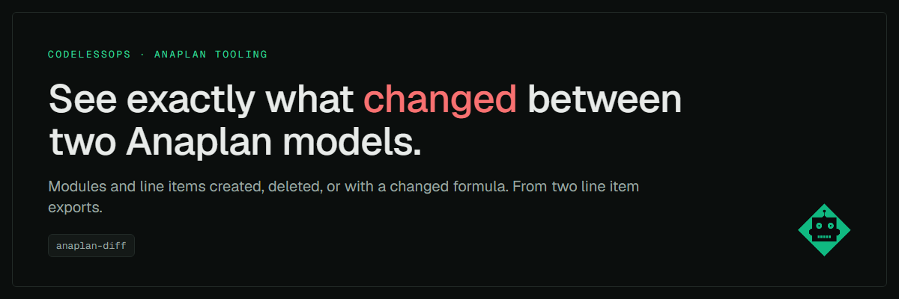
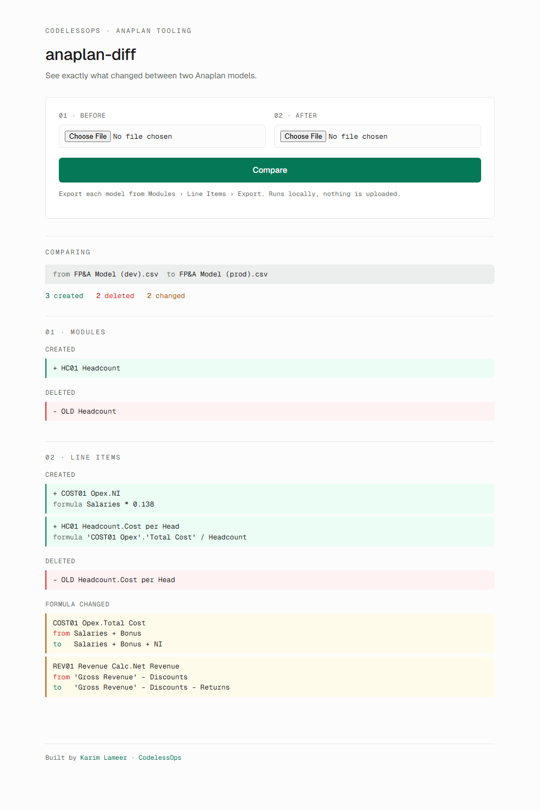

# anaplan-diff


[](LICENSE)

Diff two Anaplan models. See which modules and line items were added,
removed, or had their formula changed between two builds, from the
standard line item export. No API access, nothing leaves your machine.



## Try it in three lines

```bash
git clone https://github.com/klameer/anaplan-diff.git && cd anaplan-diff
pip install -r requirements.txt
python main.py
```

Open http://127.0.0.1:5000, upload the two exports, press Compare.

No model to hand? `docs/sample_before.csv` and `docs/sample_after.csv`
are a small fictional export pair. That is what the screenshot shows: a
module renamed (so its line item appears as a delete plus a create), one
new calculated line item, and two formula changes.

## Why I built it

Anaplan cannot answer "what changed between dev and prod?" or "what did
the last sprint touch?". ALM tells you a revision was synced, not what was
in it. Before a release I wanted a list I could paste into a change note
and hand to a model owner or an auditor, without clicking through modules
side by side.

So this takes the line item export from each model and prints the
difference.

## What it reports

- Modules deleted from the first model and created in the second
- Line items created (with their formula) and deleted
- Formula changes on line items present in both, shown as FROM and TO

Line items without a formula are ignored, so you get the calculation
logic only. That is usually what a reviewer wants.

## Getting the export

In each model go to **Modules > Line Items** and export the grid to CSV.
The tool expects the classic layout: a `Module Name` column, an unnamed
line item column, a `Formula` column.

## Reading the output

```
MODULES
  DELETE Modules
  - OLD Revenue Calc
  CREATE Modules
  + REV01 Revenue Calc

LINE ITEMS
  CREATE Line Items
  + NAME: REV01 Revenue Calc.Net Revenue | FORMULA: Gross Revenue - Discounts
  DELETE Line Items
  - OLD Revenue Calc.Net Revenue
  CHANGE Line Items
  COST01 Opex.Total Cost | FROM: Salaries + Bonus | TO: Salaries + Bonus + NI
```

A rename shows up as a delete plus a create, because the export carries
no stable ID. Read the two sections together.

## What it does not do

- It compares module names and formula text only. Dimensionality,
  formats, summary methods and applies-to changes are not diffed.
- A formula change is a string change. Reformatting whitespace or quoting
  a name shows as a change even when the logic is the same.
- It does not detect renames or tell you what a change affects
  downstream.
- If Anaplan changes the export layout, the parser needs a tweak.

If you need those, use [anaplan-grammar](https://github.com/klameer/anaplan-grammar).
Its `diff` command parses every formula, so whitespace is not a change,
finds renames, diffs formats and applies-to, and sorts each change by how
many line items sit downstream of it. It also has a `--fail-on-change`
exit code for CI. This repo stays as the small, readable version.

## Related

- [anaplan-grammar](https://github.com/klameer/anaplan-grammar): a
  parser for the Anaplan formula language, with a tree-level diff, lint,
  dependency graph and health report from the same exports.
- [anaplan-estate](https://github.com/klameer/anaplan-estate): an action
  plan and change-impact explorer for a whole estate of models.
- [anaplan-impact-analysis](https://github.com/klameer/anaplan-impact-analysis):
  from the same export, see what depends on a line item before you change it.
- [anaplan-api-starter](https://github.com/klameer/anaplan-api-starter):
  pull the exports by API instead of by hand.

MIT licensed. I'm [Karim Lameer](https://www.linkedin.com/in/karimlameer),
Master Anaplanner and CIMA-qualified accountant. I write about this at
[codelessops.com](https://codelessops.com).
